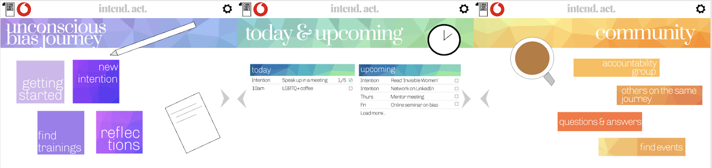
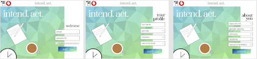
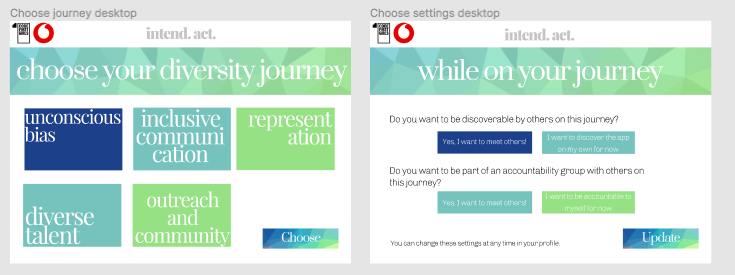
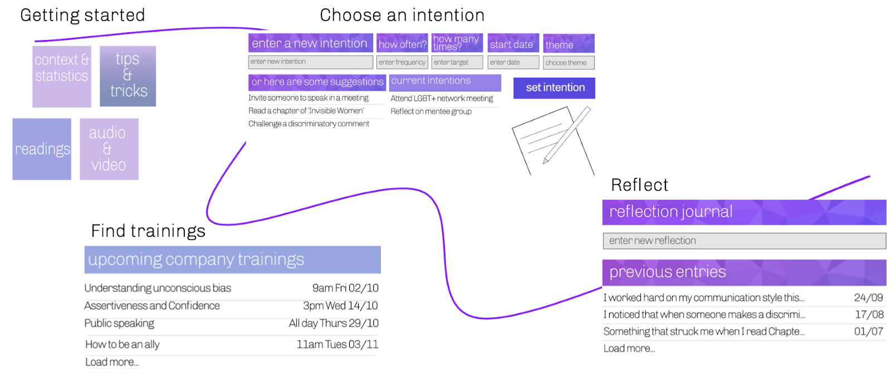
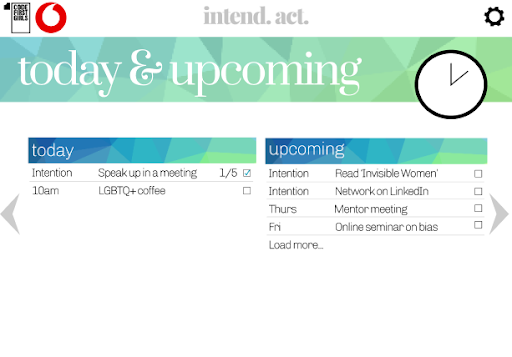
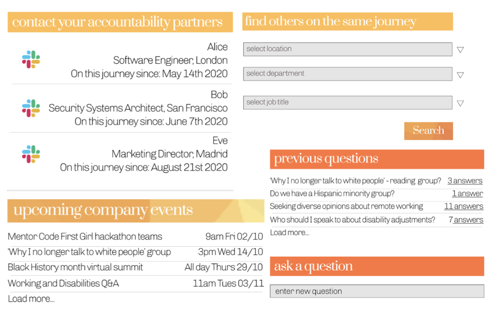
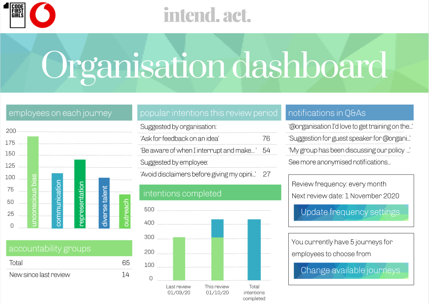

# intend. act. 

## App purpose
intend. act. is a web app designed to help organisations and their employees reflect and act upon their diversity and inclusion (D&I) practices. 

Research shows that existing D&I training often lacks impact because it’s not sufficiently ‘context-specific or action-oriented’, and because ‘a lot of organizations think that training is a ‘one and done’ thing’ (https://envoy.com/blog/how-unconscious-bias-affects-workplace-experience/). intend. act. solves this problem by facilitating an ongoing, action-oriented D&I process that can be tailored to the context of each organisation and each employee. Featuring capabilities that allow users to set personal intentions, create new communities, and learn from each other, intend. act. takes users on an intersectional, holistic and personalised journey to grow as advocates for themselves and for others.

## App users
The primary users of the app will be the employees of an organisation. Each employee will have a personal account, via which they can access the features of the app. Each employee will be able to tailor the settings of their account to suit their own D&I development. It is intended that every employee of the organisation will have their own employee account, regardless of seniority. 

In addition to this, the organisation’s leadership will have access to an employer-view dashboard, via which the leadership will be able to make macro changes to tailor the app to suit the organisation as a whole.

## App structure overview and navigation
Once they have set up an account, each user of intend. act. has access to three principal home areas: the journey home, the today & upcoming home, and the community home. The three home pages are situated on the top navigation level of the app, and the user can easily navigate between them. 

Related app features and content branch from the home pages, and the user can easily navigate back from the branches to the top-level home pages via the navigation bar.

Figure 1. The three top-level home pages. Users navigate between these pages via arrow buttons

## App flow
Signing up and setting up profile (currently under development)

Employers will initially be prompted to create a macro-level intend. act. account for their organisation: uploading their company name and logo to be displayed on the app pages, tailoring the journeys in a way that is relevant and accessible for their employees, and creating employer settings for data monitoring and analysis.

Upon creation of the employer account, employees will be invited to sign up individually. Each user will be asked for their work email address, location, job title, and seniority level; and they can choose to add any personal details about what makes them diverse members of the organisation. They will then be able to choose and embark upon a specific journey, and to define individual app settings regarding privacy. They can choose whether to be ‘discoverable’ by other employees and app users within the community pages of the app. (Users will continue to be able to adjust these privacy settings at any time.)

Figure 2. The initial login pages used by employees to create a profile on their employer’s intend. act. account

Figure 3. Employees choose a diversity journey and can tailor their privacy and community settings 

### Journey

Getting started and Trainings

Having chosen a diversity journey, employees will be given access to a curated range of information, resources, and training opportunities related to the particular journey. Employees are encouraged to get started on their journey by perusing the resources on the ‘context & statistics’, ‘audio & video’ and ‘readings’ pages. This will allow users become more familiar with their journey, with the issues at hand, and with possible first steps for themselves and for their organisation. The ‘trainings’ page will be populated with related company diversity trainings that employees will be able to filter, search, and sign up to.

#### Choose intention

Once they become more familiar with the app and the context surrounding their journey, users will be able to set an intention. Users will have the option to choose from a list of intentions curated by the organisation, to get inspired by intentions written by colleagues on the same journey, or to write their own intention. They will be empowered by the ability to specify when they want to start working on the intention, the number of times they would like to fulfill the intention, and the theme of the intention (examples include ‘allyship’ and ‘confidence’).

Upon selecting their intention(s) employees will be taken to the today & upcoming section, described below.

#### Reflect

Throughout their journey, employees have access to a reflections journal, a private space to record their experiences and look back on their journey via their past thoughts and challenges. Users also have the option to publish any entry anonymously for the benefit of other users.

Figure 4: Flow of the journey pages

This section at the moment is mostly static (except for the ‘choose an intention’ page which is responsive), although users can already navigate through the various journey pages (including the pages in ‘getting started’ which are all populated with content) and back to their journey home.

### Today & Upcoming

The today & upcoming page is at the centre of the intend. act. concept and acts as the landing page for returning users. The page provides employees with easy access to a ‘to do’ list collating all the intention(s) users are working towards as well as an indication of their frequency and progress. Also included are any events and trainings the user has signed up to. ‘To dos’ are separated into two columns: the first column contains the intentions, events, and trainings users are working on or attending that day; and the second column lists those ‘to dos’ that are coming up in the future.

As they progress, employees are given the option to ‘check’ a tick box next to each of their intentions, events, and trainings, to signal completion. If the user has chosen to fulfill a certain intention more than once (e.g. if the user has decided that they want to fulfill the intention ‘Speak up in a meeting’ 5 times, rather than just once), checking the tick box will update and display their total completions of that intention (e.g. ‘1/5'). In this way users can see their past progress, and also be reminded of what they’ve got ahead of them.

This section is currently entirely responsive, so users can input new intentions and these will appear directly on the today & upcoming page and can be checked as complete.

Figure 5: Key features of the today & upcoming intend. act. page

### Community

Via the community home employees can find and contact colleagues who are going on the same diversity journey. intend. act. is designed not only to facilitate personal, private reflection, but also to create communities and discussion, allowing users to share their insights and learn from each other, while feeling supported by their colleagues. This sense of allyship will significantly aid employees in coming up with new intentions, and in acting on their existing intentions.

#### Accountability group 

The accountability group page allows the user to view a list of their accountability partners. Employees can choose to team up with colleagues on the same journey as themselves, to provide support and accountability to each other. Links to the accountability partners’ IM platforms facilitate easy communication.

#### Find others on the same journey

This page allows the user to find new accountability partners. Employees can use a database to identify colleagues who are on the same journey as them. Filters include location, department and job title. 

#### Questions and answers

This page allows users to submit anonymous questions to the community. Users can also answer other people’s questions anonymously. Previous questions/answers are recorded and available for view. 

#### Find events

This page allows the user to find a list of, and perform a search of, upcoming company events that are relevant to their current journey.

Figure 6: Key features of the community intend. act. pages

This section at the moment is purely static, although users can already navigate through the various community pages and back to their community home.

### Employer view: ‘organisation dashboard’ (currently under development)

intend. act. enables organisations to gather anonymised, grassroots data via the organisation dashboard. The organisation’s D&I leadership has access to an employer-view dashboard that identifies trends in the usage of the app. This will include information regarding the most popular journeys and intentions chosen by the users, as well statistics monitoring the number of accountability groups. The employer can choose to allow employees to notify them directly and anonymously via an ‘@organisation’ function in the Q&As, to draw attention to ideas or questions arising from the use of the app.

The organisation dashboard also allows the employer to make adjustments to the frequency with which they review the app’s usage, and to add/remove the journeys available to employees depending on the organisation’s context-specific D&I goals.

Figure 7: intend. act. organisational dashboard

## How to run the app and other technical information

For this project we used HTML/CSS (including some Bulma CSS components) for the more static pages and styling, and JavaScript to introduce some more dynamic functionality. We used React for the ‘choose intention’, ‘today & upcoming’, and ‘events’ pages to ensure they were responsive, could easily pass information between each other, and to make the more difficult functionality easier to handle.

## Meet the development team

intend.act. was conceived, designed and developed by team 2 as part of the Code First Girls and Vodafone Diversity Hack. We are:

### Hayfa

Hayfa is a self-taught developer from London who has transitioned from biosciences into tech. She is passionate about highlighting the importance of humanity and diversity within technology as well as impacting user experiences.

### Aaliya
[Aaliya Github](https://github.com/aalipie)

Aaliya is a final year electronic engineering student who is looking to learn more about software engineering after a couple of years of hardware. She is interested in how technology disrupts sectors and wants to be a Product Manager. 

### Lonie
[Lonie Github](https://github.com/Lonies)

Lonie is a doctoral researcher in Cyber Security looking to get back to coding following a few years focusing on research. She is interested in the way technology assists in telling stories and  is looking to get a Product Management position upon graduation.

### Helen  
[Helen Github](https://github.com/helentatlow)

Helen is a doctoral researcher in German Literature who has recently embarked upon her coding journey. Having indulged her love of syntax with a Code First Girls python course, she is looking to start her career in tech/fintech.

